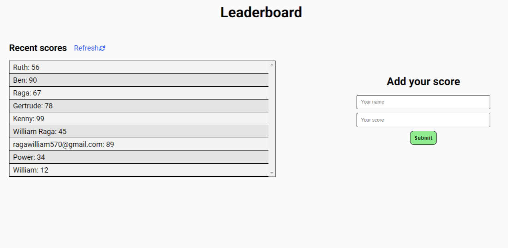
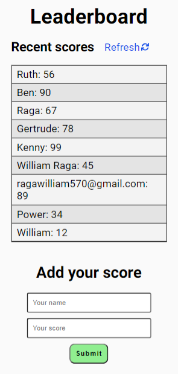

# Leaderboard
An app that consumes the Leaderboard API using JavaScript async and await. It preserves user data and sends it to the API.

## Live Preview

> [Click here to view Live Page]()

## Built with

- HTML
- CSS
- JavaScript
- Webpack

> Used best practices, ES6 e.t.c

## Setup for Basic HTML/CSS Project

- Linter for HTML/CSS installed

## Getting Started

- ### Mobile Version

  

- ### Desktop Version

  

- ### Interactive List

  - Easily edit and delete tasks on a single click

  

### Prerequisites

- Text editor
- Basic HTML/CSS Knowledge
- JavaScript
- Linters i.e. Webhint, stylelint, lighthouse and eslint.
- Git

### Setup

### Install

- [Linter](https://github.com/microverseinc/linters-config/tree/master/html-css_js)

### Usage

### Deployment

- [Linter](https://github.com/microverseinc/linters-config/tree/master/html-css_js)

## Authors

👤 **Author**

- GitHub: [@itsmraga-hub](https://github.com/itsmraga-hub)

- Twitter: [@RagaMacharia](https://twitter.com/RagaMacharia)

- Linkedin: [@itsmraga](https://www.linkedin.com/in/itsmraga/)

## 🤝 Contributing

Contributions, issues, and feature requests are welcome!

Feel free to check the [issues page](../../issues/).

## Show your support

Give a ⭐️ if you like this project!

## Acknowledgments

- Microverse team.
- Inspiration.

## License

- [MIT](https://github.com/itsmraga-hub/Leaderboard/blob/master/LICENSE)
